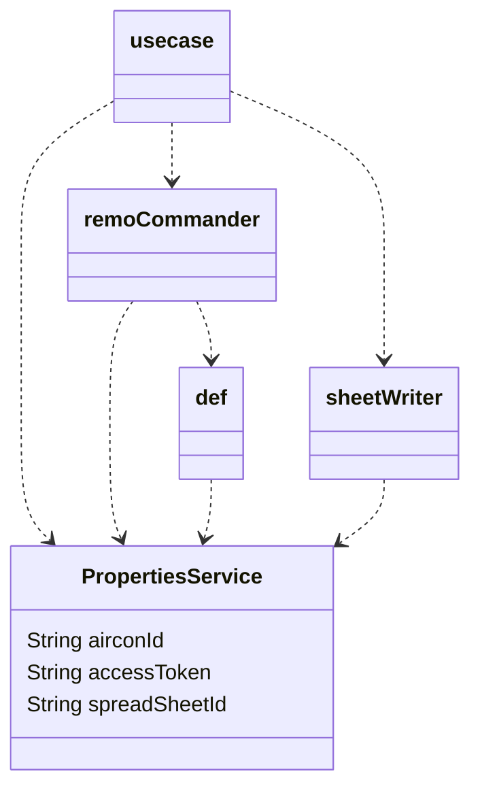

## スプレッドシート

## クラス図

```mermaid
classDiagram

def ..> PropertiesService
usecase ..> PropertiesService
usecase ..> remoCommander
usecase ..> sheetWriter
remoCommander ..> PropertiesService
remoCommander ..> def
sheetWriter ..> PropertiesService

PropertiesService : String airconId
PropertiesService : String accessToken
PropertiesService : String spreadSheetId
```
